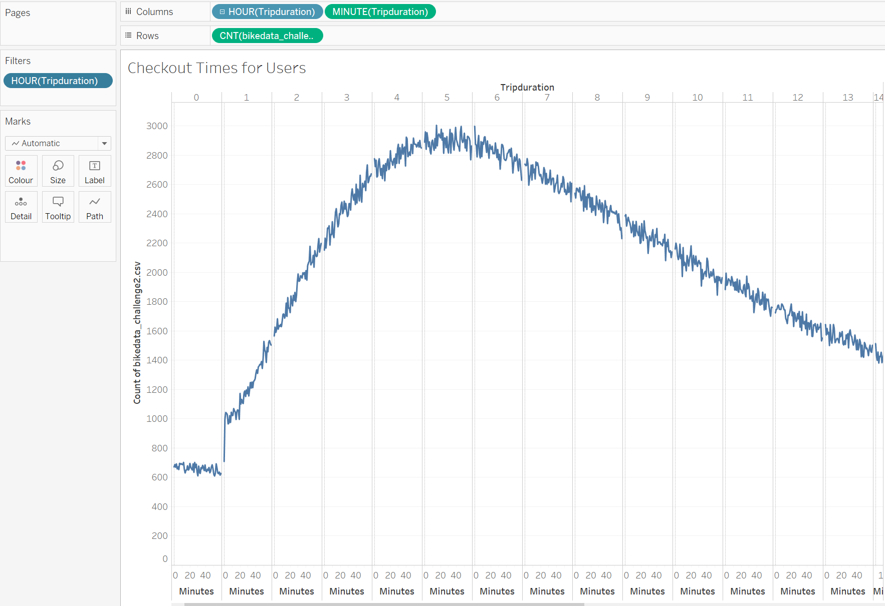
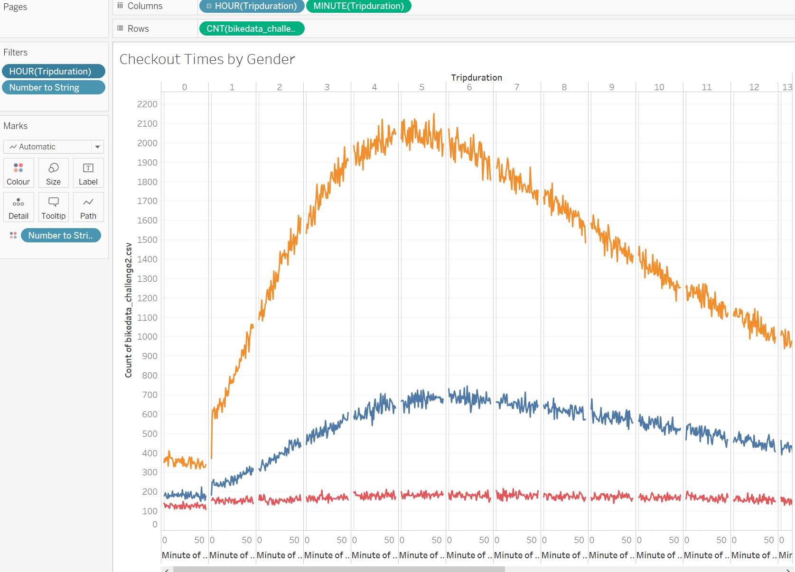
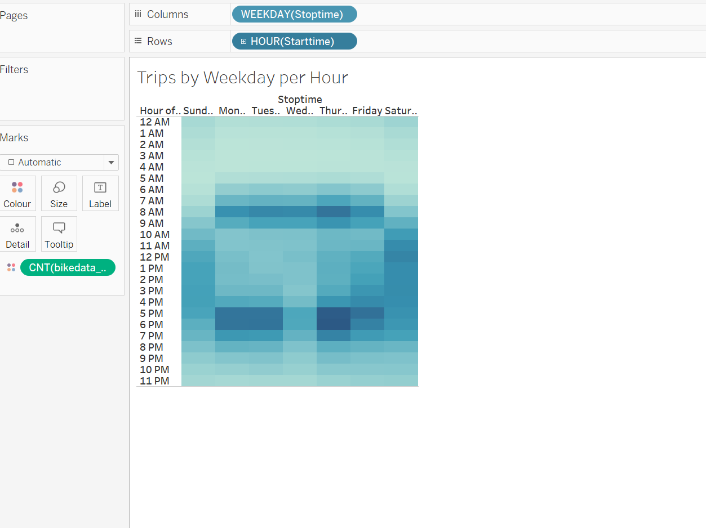
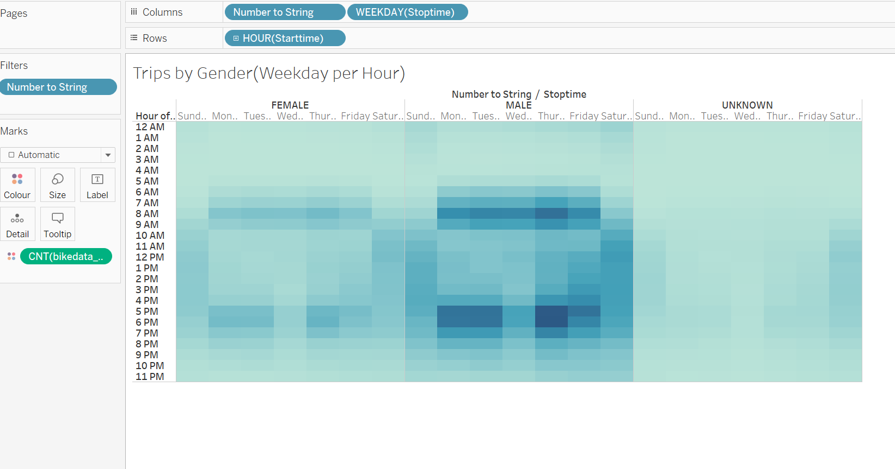
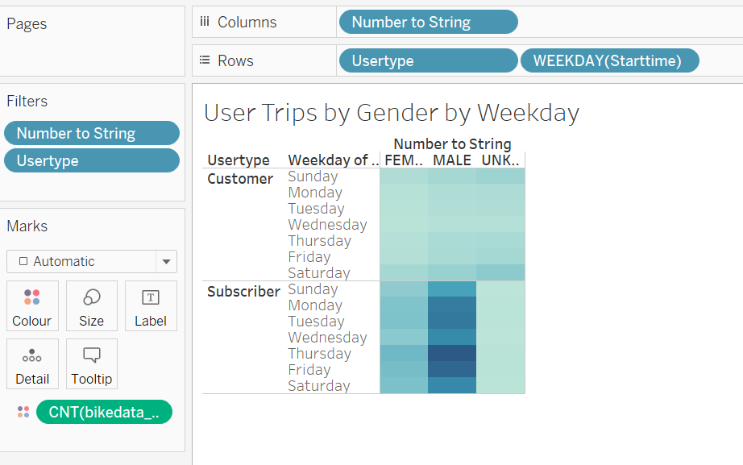

# **bikesharing**
Analysis on citibike business
## Overview of Project
In this project, we used Pandas and Tableau to organize citibike data of August 2019. The results are visualized in Tableau. This analysis is to show critical information about this business. Five visualizations are generated in Tableau, so the data is easier to be analyzed.
## Results

According to this visualization, bikes checkedout for around 4-5 hours are the most. They usually checkout bikes under 5 hours. The number of bikes checkedout for more than 5 hours are decreasing.

According to this graph, males users are substantially more than female users. They follow the pattern decribed above. Checkout time around 4-5 hours are the most popular.

According to this graph, most users use citibike from 6am to 9am and 4pm to 7pm from Monday to Friday. On weekends, from 10am to 6pm is the period of high usage of citibike.

This graph enforces the above findings. Bikes checkedout by males are much more than the bikes checkedout by females. The popular checkout times are similar to the times described in trips by weekday per hour.

According to this visualization, most users of citibike are subscribers. And among these subscribers, most of them are male. Thursday and Fridays have the most users.
## Summary
The most busy day for the users using citibike are Thursday and Friday and the time periods are from 6am o 9am and from 4pm to 7pm. Some other visualizations I would use to do further analysis include start and stop station user count to analyze the most popular stations and the birth year graph to analyze the life time of the bike which helps in estimating renovation and fixing costs.
